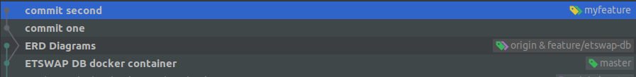
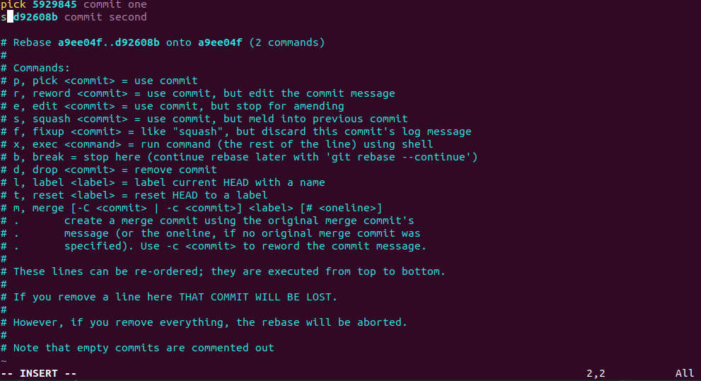

# Contributing to ESOS web

## Git workflow using rebase

1. Go to `master`, create a feature branch named `myfeature`, checkout and start working
   on it.

   a. `git checkout master`

   b. `git checkout -b myfeature`

   Alternatively, you can run `git checkout -b myfeature origin/master` in one step.
   Before this you **should** run `git fetch` either automatically or manually
   in order to be up to date.

2. Make any changes you like to add to this new feature and commit to your `myfeature`
   branch. After two commits the git log is:
   

3. When your coding is complete, but before you open a pull request and merge its branch into `origin/master`
   branch, you need to grab any new commits pushed upstream.

   a. `git checkout master`

   b. `git pull`

4. Checkout again `myfeature` branch and rebase from master

   a. `git checkout myfeature`

   b. `git rebase master`

   If conflics exists the rebase operation stops. Resolve all your conflicts and execute `git rebase --continue`

   Alternatively you can do `git fetch` and then `git rebase origin/master` in your current working branch
   to avoid checking out back and forth from master.

5. Before pushing squash all your commits into one using `git rebase -i master`. Pick the first commit
   and squash the subsequent commits into one.
   

## Commit message convention

The commited messages should be formatted using the following standards:

- feat(module): A new feature
- fix(module): A bug fix
- docs: Documentation only changes
- style: Changes that do not affect the meaning of code
- refactor(module): A code change that neither fixes a bug or adds a feature
- perf(module): A code change that improves performance
- test(module): Add missing tests
- chore: Changes to the build process or auxiliary tools and libraries such as documentation generation
- ci: Changes to the continuous integration process

Because we are using husky commit hooks the commit messages should also contain the JIRA
ticket they are fixing or implementing. An example commit message is the following:

```
feat(registration): ESOS-123 - a new feature for registration
```

If you want to skip this check you can add the `--no-verify` flag, e.g.:

```shell script
git commit --no-verify
```

## Creating new code parts

- Use the `ng` generator for any new components/services/pipes etc. The generator is configured so that many best practices are preset.
- Keep the module structure flat. Modules should not be nested, and components should not be nested under other components.
- Place guards next to their related components.
- Type as strictly as possible, but do not overtype. Typescript has great inference, and not every argument should be typed, if it can be safely inferred.

## Practices

The project does not use any major external library besides Angular.
Utility libraries such as lodash are used scarcely, and should be avoided.

All latest ES6 features are supported and encouraged, however Observables are used for all async operations instead of any native
alternatives such as Promise/Timeout.

Root forms should be created using the `FormBuilder`, not the `FormGroup` constructor.
Such forms update their values on submission. If some form elements, such as checkboxes/radios that reveal content
require so, they should be designated to `updateOn: 'blur'`.

### Relative external info

Below are some helpful links regarding coding approaches:

- [RxJS documentation](https://rxjs-dev.firebaseapp.com/)
- [GOV.UK Design System](https://design-system.service.gov.uk/)
- [HMCTS Design System](https://hmcts-design-system.herokuapp.com/)
- [Form field autocompletion](https://www.w3.org/TR/html52/sec-forms.html#sec-autofill)
