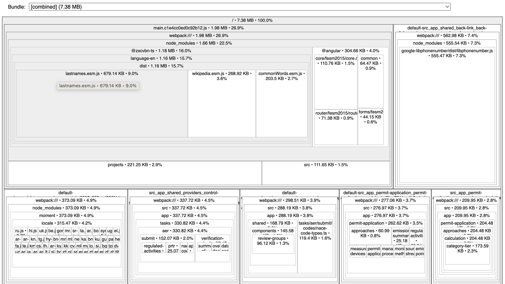

# UK ESOS - Web

## Installation

### Prerequisites

In order to successfully build and run the project you should first install the
local dependencies:

```bash
yarn install
```

## Dependencies

The web application relies on two projects.

### The `govuk-components` library

is an Angular implementation of the [GDS components](https://design-system.service.gov.uk/components/)
and can be found [here](projects/govuk-components/). It is an application agnostic approach, and no ESOS specific business affects it.
Any custom components based on GDS are built on top of the `govuk-components` library and the `govuk-frontend` library's CSS,
and usually placed in the main application's `SharedModule`.

### The `esos-api` library

is an OpenAPI generated library that contains services and models related to the ESOS API and can be found [here](projects/esos-api/).

## Build

The libraries of the project must be build first if there are new versions. To build both libraries at once, run the custom script:

```shell script
yarn prebuild
```

If you want to build only the `govuk-components` library you can run:

```shell script
yarn build:govuk-components
```

If you want to build only the `esos-api` library you can run:

```shell script
yarn build:esos-api
```

The build artifacts will be stored in the `dist/` directory.

To build the application you should run the following command:

```shell script
yarn build
```

In order to build the project for the production environment:

```shell script
yarn build:production
```

## Development server

To start the application using the Angular's development server run:

```shell script
yarn start
```

This will build and serve the application under [http://localhost:4200](http://localhost:4200).
The app will automatically rebuild and reload if you change any of the source files.

## Analyze Bundles

To start analyzing bundles run:

```shell script
yarn analyze
```

This will build the app, generate all `source-maps` needed by `source-map-explorer` and open a browser tab where you can view all bundles.



## How to run Sonarqube locally

1. Make sure you have sonarqube running locally. If you're running the docker compose from the [uk-esos-env-development](https://git.trasys.gr/bitbucket/projects/UKESOS/repos/uk-esos-env-development/browse) this should be enough.
2. Log into your local sonarqube running at http://localhost:9000. If this is your first time you'll be prompted to change your default credentials (initial ones are admin-admin).
3. Create a sonarqube project manually. Project display name, project key and main branch name do not matter. For consistency purposes you can type `uk-esos-web`, `uk-esos-web` and `master` respectively.
4. Choose `global settings` in the next screen and click `Create Project`.
5. Click the `Locally` option to set up sonar-scanner locally.
6. Generate a token and paste it in the `sonar.login` variable in the `sonar-project.properties` file found in the root of this repository.
7. Change the sonarqube password in `package.json` file in the root of this repository. This should be found under the `scripts` section at the `sonar:local` script.
8. Run `yarn sonar:local`. After completion you should be able to see the results at http://localhost:9000/projects, under the sonarqube project you just created.

## Unit tests

When developing for ESOS web application try to keep the coverage in a good level.

To execute the application's unit tests run:

```shell script
yarn test:frontend
```

To execute the govuk-components library tests you can run:

```shell script
yarn test:govuk-components
```

If you want to find out the coverage of the both the application and the govuk-compoents
library you can apply the `:coverage` flag in the above commands, e.g.:

```shell script
yarn test:frontend:coverage
```

The coverage can the be found in the command line or in the `coverage/` folder which
will be generated inside the parent folder of each project.

## Release plan and changelog generation

Every two weeks by the end of each sprint a new minor release should be
up and running. There is also a need to generate the changelog for each release.
For these purposes there are three scripts in the `package.json` file

### Patch release

To generate a new patch release you should run:

```bash
yarn release:patch
```

### Minor release

To generate a new minor release you should run:

```bash
yarn release:minor
```

### Major release

To generate a new major release you should run:

```bash
yarn release:major
```

The changelog is generated automatically and can be found under the [CHANGELOG.md](CHANGELOG.md) file.
